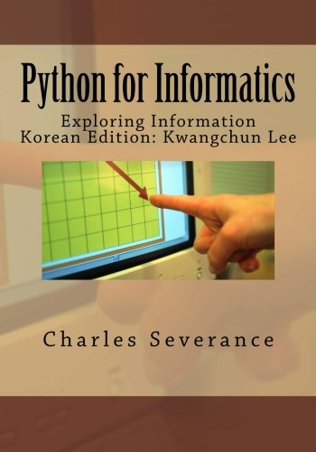

### [정보교육을 위한 파이썬: 데이터 과학자로의 여정](http://python.xwmooc.org/)

**대한민국 전 국민을 단돈 천원($1) 정보교육으로 행복한 세상 만들기**

첫 인터넷 웹 브라우저를 만든 마크 앤더슨은 소프트웨어가 세상을 먹고 있다("Software is eating the world")는 자극적인 표현으로 2011년 월스트리트 저널에 에세이를 썼고, 카네기멜론 대학의 쟈넷 윙 교수는 이론적 사고(Theoretical Thinking), 실험적 사고(Experimental Thinking))와 더불어 컴퓨팅 사고(Computational Thinking)가 현재도 그렇지만 앞으로 인간의 사고를 지배하는 중추적인 역할을 할 것을 주장했다. 이들의 결과는 정보적 사고를 배운 사람과 소프트웨어를 이해하고 활용하는 사람과 그렇지 못한 사람과의 차이는 산업경제의 빈부격차보다 더큰 디지털 경제의 정보 불평등(Digital Divide)를 야기할 것으로 예측했다.

소프트웨어 중심 사회와 데이너 과학자로 준비로 필요한 소양중의 하나가 데이터를 자유로이 다룰 수 있는 능력과 기술이고 이를 함양하기 위해서 정보교육 서적인 [정보교육을 위한 파이썬](../book.pdf)은 이를 준비하는데 무료로 거부감없이 관심있는 누구나 접할 수 있게 제공합니다.

[정보교육을 위한 파이썬](../book.pdf) 책의 자유로운 편집과 공유를 위해서 [GitHub 협업 공간](https://github.com/statkclee/py4inf-kor)에 한국어 번역의 모든 내용이 투명하게 공유되어 있습니다.

[정보교육을 위한 파이썬](../book.pdf)은 [Python for Informatics: Exploring Information](http://www.pythonlearn.com/book.php)을 기반으로 하였기 때문에 영어공부에 관심이 많은 학생이나 일반인도 어학실력을 함양하면서 파이썬, 데이터 과학, 정보교육 등 여러 목적을 동시에 달성할 수 있다고 생각됩니다.

|               |                     |                       |
|---------------|---------------------|-----------------------|
|  |                 | **정보교육을 위한 파이썬** 은 아마존에 [Python for Informatics: Exploring Information(Korean Edition)](http://amzn.to/1N74xLt)으로 주문이 가능하오니, 책으로 꼭 필요하신 분은 주문하시면 됩니다. 그리고, 책 판매에 따른 수익은 영문판, 스페인어판, 중문판과 함께 [Charles Severance](http://dr-chuck.com/) 교수님이 직접 자선단체에 기부하십니다. 

데이터 과학을 준비하고 싶지만, 파이썬이 불편하다면 [러플(RUR-PLE)](http://rur-ple.xwmooc.org)로 예전에 선행학습 하셨는데, [리보그(reeborg)](http://reeborg.xwmooc.org)가 최근에 나와 사전 준비를 하고 시작하는 것도 좋은 접근 방법입니다.

사전에 한국어 번역도 필요하지만 영어 어학에 대한 학습도 고려하여 당분간은 영어원문 그대로 연결하여 영어 학습도 함께 할 수 있게 준비되었습니다.

- 정보교육을 위한 파이썬에 오신 것을 환영합니다. - (<a href="http://www.youtube.com/watch?v=UQVK-dsU7-Y" target="_new">YouTube</a>)

- 1장 - 왜 프로그래밍을 배워야 하는가? <a href="http://www.pythonlearn.com/youtube/Py4Inf-01-Intro.php" target="_blank">YouTube</a>
- 2 장- 변수, 표현식, 스테이트먼트(Statement) <a href="http://www.pythonlearn.com/youtube/Py4Inf-02-Expressions.php" target="_blank">YouTube</a>
- 3 장- 조건부 실행 <a href="http://www.pythonlearn.com/youtube/Py4Inf-03-Conditional.php" target="_blank">YouTube</a>
- 4 장- 함수 <a href="http://www.pythonlearn.com/youtube/Py4Inf-04-Functions.php" target="_blank">YouTube</a>
- 5 장- 반복(iterations) <a href="http://www.pythonlearn.com/youtube/Py4Inf-05-Iterations.php" target="_blank">YouTube</a>
- 6 장- 문자열 <a href="http://www.pythonlearn.com/youtube/Py4Inf-06-Strings.php" target="_blank">YouTube</a>
- 7 장- 파일 <a href="http://www.pythonlearn.com/youtube/Py4Inf-07-Files.php" target="_blank">YouTube</a>
- 8 장- 리스트 <a href="http://www.pythonlearn.com/youtube/Py4Inf-08-Lists.php" target="_blank">YouTube</a>
- 9 장- 딕셔너리 <a href="http://www.pythonlearn.com/youtube/Py4Inf-09-Dictionaries.php" target="_blank">YouTube</a>
- 10 장- 튜플 <a href="http://www.pythonlearn.com/youtube/Py4Inf-10-Tuples.php" target="_blank">YouTube</a>
- 11 장- 정규 표현식 <a href="http://www.pythonlearn.com/youtube/Py4Inf-11-Regex.php" target="_blank">YouTube</a>
- 12 장- 네트워크 프로그래밍 (HTTP) <a href="http://www-personal.umich.edu/~csev/books/py4inf/media/Py4Inf-12-HTTP.ppt" target="_blank">슬라이드</a>, <a href="https://www.youtube.com/watch?v=Zr8BQiPNaFI&index=30&list=PLlRFEj9H3Oj4JXIwMwN1_ss1Tk8wZShEJ"
    target="_blank">YouTube</a>
- 13 장- 웹 서비스(Web Services) <a href="http://www-personal.umich.edu/~csev/books/py4inf/media/Py4Inf-13-WebServices.ppt" target="_blank">슬라이드</a>, 
<a href="https://www.youtube.com/watch?v=6cwi1NcL0Zc&index=31&list=PLlRFEj9H3Oj4JXIwMwN1_ss1Tk8wZShEJ" target="_blank">YouTube</a>
- 14 장- 데이터베이스(Databases) <a href="http://www-personal.umich.edu/~csev/books/py4inf/media/Py4Inf-14-Database.ppt" target="_blank">슬라이드</a> 
